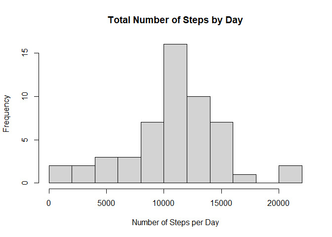
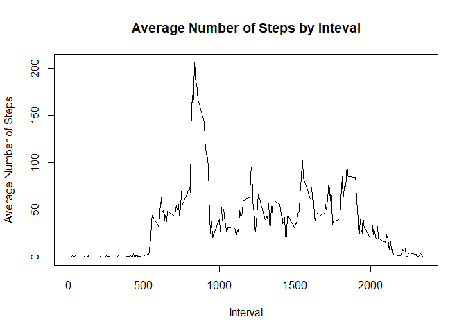
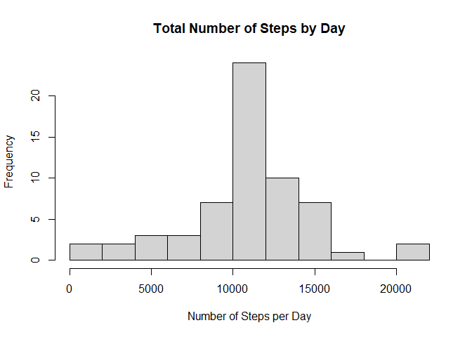

## Loading and preprocessing the data
1. Load the data 

```r
activity <- read.csv("activity.csv")
head(activity)
```

```
##   steps       date interval
## 1    NA 2012-10-01        0
## 2    NA 2012-10-01        5
## 3    NA 2012-10-01       10
## 4    NA 2012-10-01       15
## 5    NA 2012-10-01       20
## 6    NA 2012-10-01       25
```
2. Process Transform the data
+ The data will be processed to remove the NA values

```r
activity_filtered <- activity[complete.cases(activity),]
```

## What is mean total number of steps taken per day?
1. Calculate the total number of steps taken per day

```r
act_by_day <- aggregate(steps ~ date, activity_filtered,sum)
act_by_day
```

```
##          date steps
## 1  2012-10-02   126
## 2  2012-10-03 11352
## 3  2012-10-04 12116
## 4  2012-10-05 13294
## 5  2012-10-06 15420
## 6  2012-10-07 11015
## 7  2012-10-09 12811
## 8  2012-10-10  9900
## 9  2012-10-11 10304
## 10 2012-10-12 17382
## 11 2012-10-13 12426
## 12 2012-10-14 15098
## 13 2012-10-15 10139
## 14 2012-10-16 15084
## 15 2012-10-17 13452
## 16 2012-10-18 10056
## 17 2012-10-19 11829
## 18 2012-10-20 10395
## 19 2012-10-21  8821
## 20 2012-10-22 13460
## 21 2012-10-23  8918
## 22 2012-10-24  8355
## 23 2012-10-25  2492
## 24 2012-10-26  6778
## 25 2012-10-27 10119
## 26 2012-10-28 11458
## 27 2012-10-29  5018
## 28 2012-10-30  9819
## 29 2012-10-31 15414
## 30 2012-11-02 10600
## 31 2012-11-03 10571
## 32 2012-11-05 10439
## 33 2012-11-06  8334
## 34 2012-11-07 12883
## 35 2012-11-08  3219
## 36 2012-11-11 12608
## 37 2012-11-12 10765
## 38 2012-11-13  7336
## 39 2012-11-15    41
## 40 2012-11-16  5441
## 41 2012-11-17 14339
## 42 2012-11-18 15110
## 43 2012-11-19  8841
## 44 2012-11-20  4472
## 45 2012-11-21 12787
## 46 2012-11-22 20427
## 47 2012-11-23 21194
## 48 2012-11-24 14478
## 49 2012-11-25 11834
## 50 2012-11-26 11162
## 51 2012-11-27 13646
## 52 2012-11-28 10183
## 53 2012-11-29  7047
```
2. Make a histogram of the total number of steps taken each day

```r
hist(act_by_day$steps, main = "Total Number of Steps by Day", xlab = "Number of Steps per Day", breaks = 10)
```

<!-- -->

3. Calculate and report the mean and median of the total number of steps taken per day
+ Mean

```r
mean(act_by_day$steps)
```

```
## [1] 10766.19
```
+ Median

```r
median(act_by_day$steps)
```

```
## [1] 10765
```

## What is the average daily activity pattern?
1. Make a time series plot of the 5-minute interval and the average number of steps taken, averaged across all days

```r
act_by_interval <- aggregate(steps ~ interval, activity_filtered, mean)
plot(act_by_interval$interval, act_by_interval$steps, type = "l", main = "Average Number of Steps by Inteval", xlab = "Interval", ylab = "Average Number of Steps")
```

<!-- -->

2. Which 5-minute interval, on average across all the days in the dataset, contains the maximum number of steps?
+ The interval with the maximum number of steps is:

```r
act_by_interval[which.max(act_by_interval$steps),1]
```

```
## [1] 835
```

## Imputing missing values
1. Calculate and report the total number of missing values in the dataset.
The total number of missing rows is:

```r
sum(!complete.cases(activity))
```

```
## [1] 2304
```
2. Devise a strategy for filling in all of the missing values in the dataset.
+ The strategy used is to fill the missing values with the mean of the interval.

3. Create a new dataset that is equal to the original dataset but with the missing data filled in

```r
na <- which(is.na(as.character(activity$steps)))
activity_complete <- activity
activity_complete[na,]$steps <- unlist(lapply(na, FUN = function(na){act_by_interval[activity_complete[na,]$interval == act_by_interval$interval,]$steps}))
head(activity_complete)
```

```
##       steps       date interval
## 1 1.7169811 2012-10-01        0
## 2 0.3396226 2012-10-01        5
## 3 0.1320755 2012-10-01       10
## 4 0.1509434 2012-10-01       15
## 5 0.0754717 2012-10-01       20
## 6 2.0943396 2012-10-01       25
```
4. Make a histogram of the total number of steps taken each day and Calculate and report the mean and median total number of steps taken per day. Do these values differ from the estimates from the first part of the assignment? What is the impact of imputing missing data on the estimates of the total daily number of steps?

```r
act_comp_by_day <- aggregate(steps ~ date, activity_complete, sum)
hist(act_comp_by_day$steps, main = "Total Number of Steps by Day", xlab = "Number of Steps per Day", breaks = 10)
```

<!-- -->

+ Mean

```r
mean(act_comp_by_day$steps)
```

```
## [1] 10766.19
```
+ Median

```r
median(act_comp_by_day$steps)
```

```
## [1] 10766.19
```
Inputting the missing data made no changes on the mean. However, it changed the median by:

```r
median(act_comp_by_day$steps) - median(act_by_day$steps)
```

```
## [1] 1.188679
```

## Are there differences in activity patterns between weekdays and weekends?
1. Create a new factor variable in the dataset with two levels – “weekday” and “weekend” indicating whether a given date is a weekday or weekend day.

```r
activity_complete$day <- ifelse(as.factor(weekdays(as.Date(activity_complete$date))) == "Saturday" | as.factor(weekdays(as.Date(activity_complete$date))) == "Sunday", "weekend", "weekday") 
head(activity_complete)
```

```
##       steps       date interval     day
## 1 1.7169811 2012-10-01        0 weekday
## 2 0.3396226 2012-10-01        5 weekday
## 3 0.1320755 2012-10-01       10 weekday
## 4 0.1509434 2012-10-01       15 weekday
## 5 0.0754717 2012-10-01       20 weekday
## 6 2.0943396 2012-10-01       25 weekday
```
2. Make a panel plot containing a time series plot of the 5-minute interval (x-axis) and the average number of steps taken, averaged across all weekday days or weekend days (y-axis)

```r
act_comp_by_interval <- aggregate(steps ~ interval+day, activity_complete, mean)
library(lattice)
xyplot(steps ~ interval | day, data = act_comp_by_interval, layout = c(1, 2), type = "l", xlab = "Interval", ylab = "Number of Steps")
```

<!-- -->
